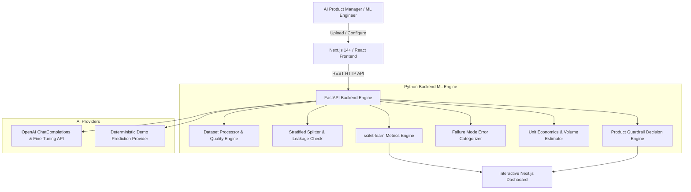

# TuneLab — AI Fine-Tuning Experimentation Platform

[](https://python.org)
[](https://fastapi.tiangolo.com)
[](https://nextjs.org)
[](https://scikit-learn.org)
[](LICENSE)

> **"Don't fine-tune because you can. Fine-tune when the measured product impact justifies it."**

TuneLab is an end-to-end AI Product Management & ML Evaluation platform designed to answer the fundamental product decision: **"Is LLM fine-tuning actually worth it for this use case?"**

Rather than assuming fine-tuning is superior, TuneLab executes a controlled Python-driven evaluation pipeline comparing baseline prompt models against fine-tuned models on held-out test sets. It computes exact scikit-learn metrics (Accuracy, Precision, Recall, Macro F1, Per-class F1, Confusion Matrix), performs failure mode error analysis, calculates unit economics and latency tradeoffs, and programmatically evaluates business guardrails to output actionable rollout recommendations.

---

## 🎯 Problem Statement

AI product teams frequently jump to fine-tuning LLMs without first establishing whether customization creates enough measurable product value to justify:
1. Higher inference costs ($/1K predictions)
2. Fine-tuning training expense & pipeline setup
3. Increased maintenance & model drift burden
4. Serving latency trade-offs

A higher raw benchmark score does not automatically make a model a better **product**. Quality, cost, latency, reliability, and business SLAs must be evaluated holistically.

---

## 🚀 Solution Overview

TuneLab provides a structured 7-phase experimentation workflow:
1. **`01 Dataset`**: Validate CSV/JSONL schema, class distributions, and calculate dataset health score (0-100).
2. **`02 Baseline`**: Establish baseline prompt hypotheses and SLA guardrails (Target F1, Cost Cap, Latency SLA).
3. **`03 Fine-Tune`**: Format training split into OpenAI Chat JSONL format and estimate token costs.
4. **`04 Evaluate`**: Compute scikit-learn classification metrics on held-out test data.
5. **`05 Analyze`**: Categorize misclassification failure modes and calculate dynamic volume cost tradeoffs.
6. **`06 Decide`**: Programmatically output deployment decisions (`RECOMMENDED`, `CONSIDER`, `NOT_RECOMMENDED`).
7. **`07 Rollout`**: Generate a 4-phase traffic rollout plan (5% → 25% → 50% → 100%) with automated rollback triggers.

---

## 🏗️ System Architecture



---

## 🧠 Python ML Pipeline Detail

At least 40-50% of core application logic lives in Python:

- **Dataset Quality Scoring (`dataset_quality.py`)**: Programmatic 0-100 score weighted across:
  - 30% Completeness
  - 20% Class Balance (Entropy ratio)
  - 20% Duplicate Rate
  - 15% Label Consistency & Class Support
  - 15% Text Quality & Outlier Detection
- **Stratified Dataset Splitting (`splitter.py`)**: Uses scikit-learn `train_test_split` with stratification to create 70% Train / 15% Val / 15% Test splits, with strict ID set intersection checks to prevent data leakage.
- **Metrics Computation (`metrics.py`)**: Exact scikit-learn calculations for `accuracy_score`, `precision_score`, `recall_score`, `f1_score(average='macro')`, and raw/normalized `confusion_matrix`.
- **Error Analysis Engine (`error_analysis.py`)**: Categorizes failures into 6 distinct modes (*Similar Classes*, *Ambiguous Short Text*, *Long Input*, *Rare Class Support*, *Labeling Issue*, *Wrong Classification*).
- **Cost Estimator (`cost_estimator.py`)**: Calculates token training costs, inference cost per 1,000 predictions, and monthly volume projections ($/mo).
- **Product Decision Engine (`decision_engine.py`)**: Rule-based decision evaluator enforcing hypothesis thresholds and SLA guardrails.

---

## 📊 Product Metrics & Governance

### North Star Metric
- **Successful AI Experiment Decision Rate**: Percentage of AI use-case decisions backed by empirical baseline-vs-fine-tuned evaluation data before production rollout.

### Supporting Product Metrics
- **Experiment Completion Rate**
- **Average F1 Score Improvement (+11.1 pts demo baseline)**
- **Dataset Health Score (Avg 92/100)**
- **Inference Cost Delta ($/1K predictions)**
- **Time to Deployment Decision**

---

## 💡 Key Product & PM Interview Insights

1. **Why compare against a baseline?**
   - Baseline prompting is faster to deploy and cheaper to maintain. Comparing against a baseline ensures we only introduce fine-tuning when standard prompt engineering fails to meet SLA requirements.
2. **Why held-out test sets & data leakage checks?**
   - Training-set evaluation causes severe overfitting bias. TuneLab uses deterministic stratified splits and verifies ID set intersections to guarantee reliable out-of-sample evaluation.
3. **Why Macro F1 instead of simple accuracy?**
   - In real-world customer support datasets, simple accuracy can be misleading (e.g. 90% accuracy on majority billing tickets while failing completely on cancellation requests). Macro F1 weights all classes equally.
4. **Why evaluate cost and latency alongside quality?**
   - A model with +2% higher score that costs 5x more or breaches latency SLAs is a bad product decision. Product decisions must balance quality, unit economics, latency, and operational risk.

---

## 🛠️ Technology Stack

- **Frontend**: Next.js 14+, React 18, TypeScript, Tailwind CSS, Recharts, Lucide Icons.
- **Backend**: Python 3.11+, FastAPI, Pydantic v2, Uvicorn.
- **ML / Data**: pandas, numpy, scikit-learn, tiktoken.
- **AI Integration**: OpenAI Fine-Tuning API, ChatCompletions, Demo Provider.
- **Testing**: pytest (Python), Vitest / Playwright (Frontend).

---

## ⚡ Quick Start & Local Setup

### Prerequisites
- Python 3.11+
- Node.js v18+ and npm

### 1. Clone & Setup Python Backend

```bash
# Navigate to repository root
cd tunelab-ai

# Install Python backend dependencies
py -3.11 -m pip install -r backend/requirements.txt

# Run Python Pytest test suite
$env:PYTHONPATH="backend"; py -3.11 -m pytest backend/tests

# Start FastAPI backend server
py -3.11 -m uvicorn app.main:app --app-dir backend --reload --port 8000
```

FastAPI interactive API documentation available at `http://127.0.0.1:8000/docs`.

### 2. Setup Next.js Frontend

```bash
# Open new terminal in tunelab-ai/frontend
cd frontend

# Install frontend dependencies
npm install

# Run frontend build
npm run build

# Start Next.js development server
npm run dev
```

Open `http://localhost:3000` in your browser.

---

## 🌐 Environment Variables

Copy `.env.example` to `.env.local`:

```env
DEMO_MODE=true
NEXT_PUBLIC_API_URL=http://127.0.0.1:8000
OPENAI_API_KEY=your_openai_api_key_here
```

*Note: TuneLab functions out-of-the-box in DEMO MODE even without an OpenAI API key.*

---

## 🚢 Deployment

### Deploying Frontend to Vercel
1. Push repository to GitHub.
2. Import `frontend/` directory into Vercel.
3. Set environment variable `NEXT_PUBLIC_API_URL` to your deployed Python backend URL.
4. Deploy!

### Deploying Python Backend
Deploy the FastAPI backend to Railway, Render, Fly.io, or AWS Lambda using `uvicorn app.main:app --host 0.0.0.0 --port 8000`.

---

## 📄 License

MIT License — see [LICENSE](LICENSE) for details.
